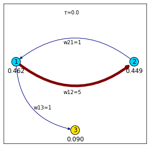

# Trying to understand infomap


## Installing


Clone into your project directory `projects-dir/pname` 

```bash
cd projects-dir
git clone https://github.com/humbertocarmona.git pname
cd pname
python -m pip install -r requirements.txt
```
you are ready to go...
